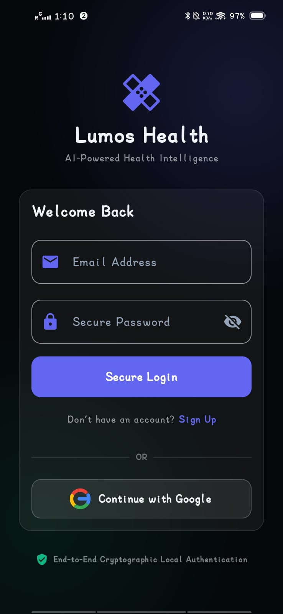
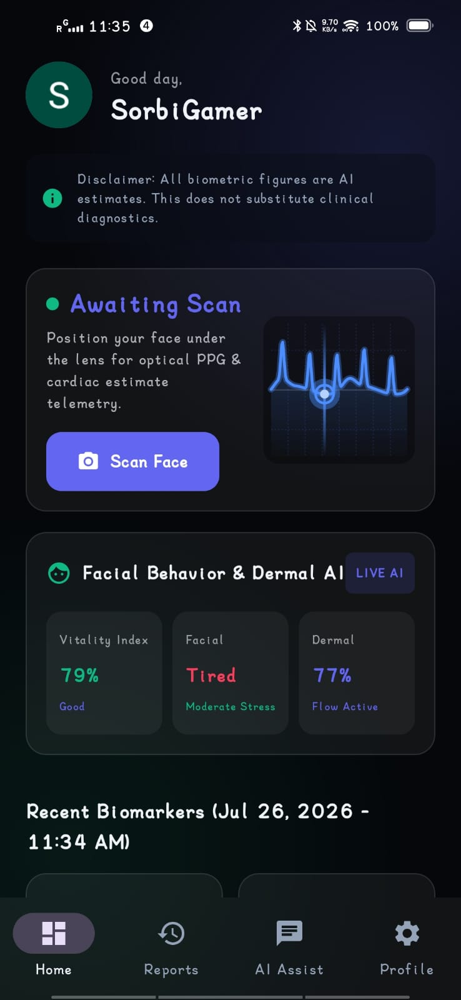
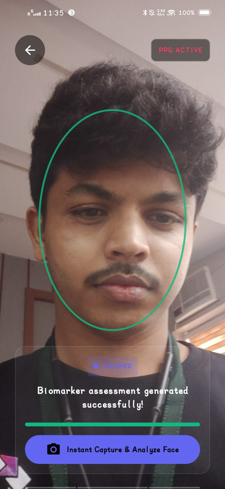
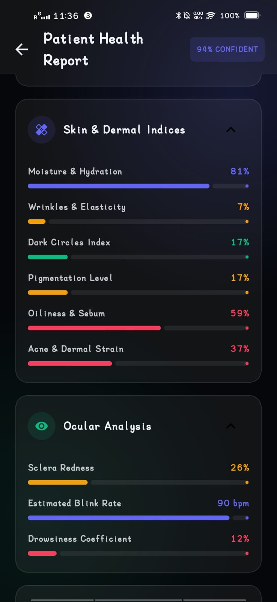
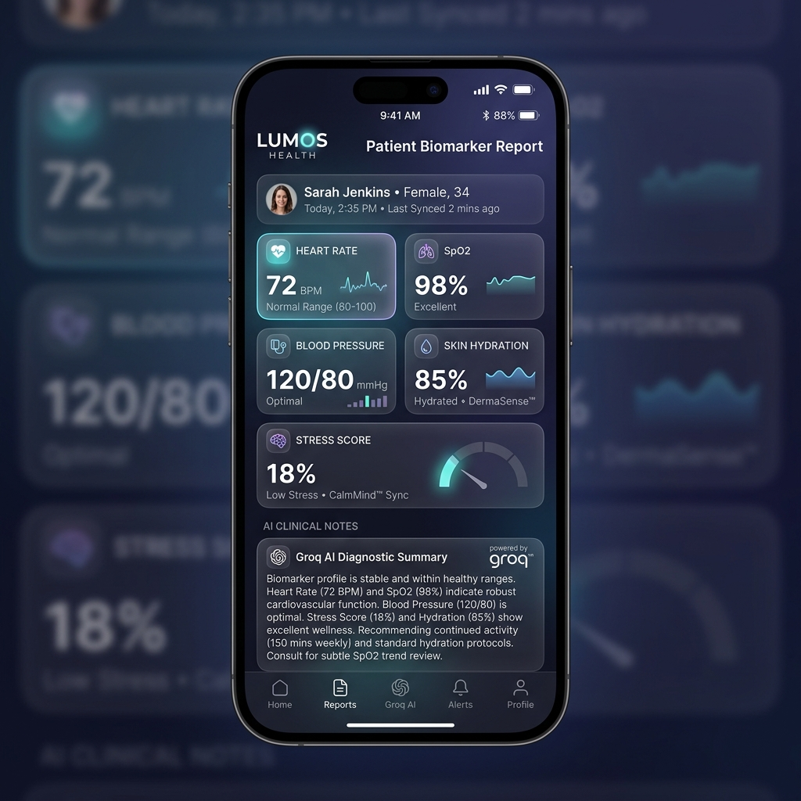
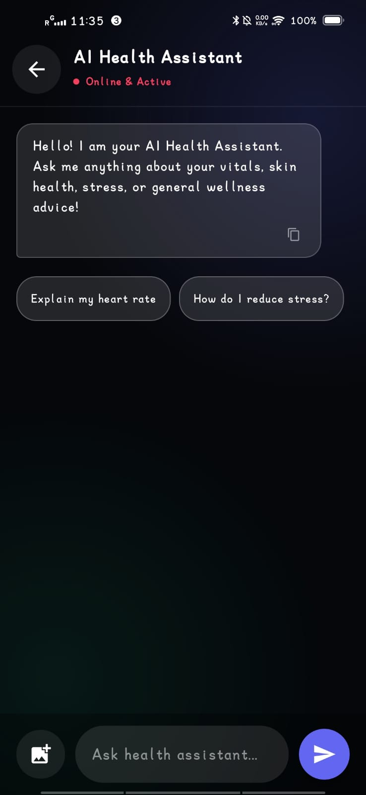
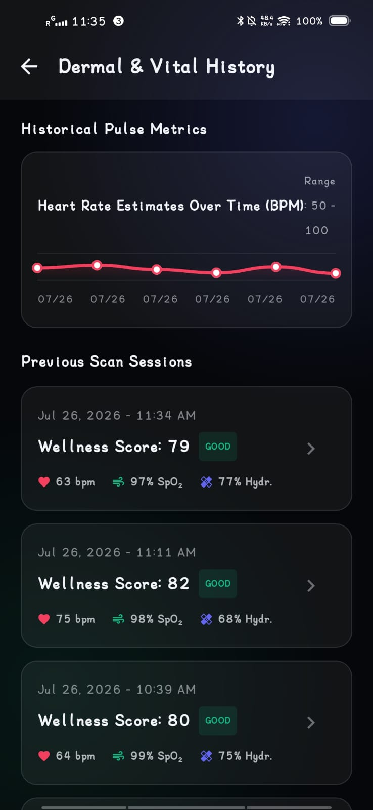
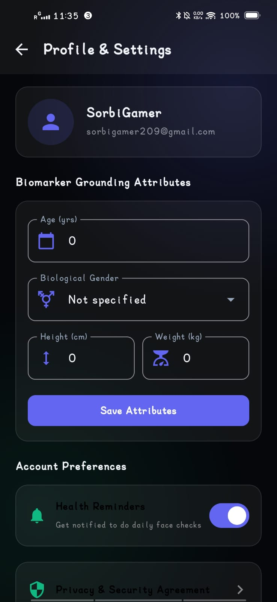

# <div align="center">


<h1>🩺 Lumos Health</h1>

### **AI-Powered Non-Invasive Optical Telemetry & Intelligent Health Analytics Platform**

<p align="center">


<br>


</p>


</div>

------

# 📱 Download Android App

<div align="center">

### 🚀 Experience **Lumos Health** on your Android device

Download the latest APK and start monitoring your health with AI-powered optical scanning.

<br>

<a href="https://drive.google.com/uc?export=download&id=18XtzDpSvjkp7myYRKNYtnR3lXZG0297W">
  
</a>

<br><br>

📦 **Latest Release:** `Lumos.apk`

📱 **Platform:** Android 14+

⚡ **Size:** *(Update with APK size)*

🔐 **Secure Google Drive Download**

<br>

> **Can't download?**  
> Click here 👉 **[Download Lumos Health APK](https://drive.google.com/uc?export=download&id=18XtzDpSvjkp7myYRKNYtnR3lXZG0297W)**

</div>

---

# ✨ Overview

**Lumos Health** transforms a standard smartphone camera into an advanced AI-powered health monitoring device using **Remote Photoplethysmography (rPPG)**, Computer Vision, Signal Processing, Artificial Intelligence, and Cloud Computing.

The application performs **real-time physiological estimation**, **facial health analysis**, **skin assessment**, **medical AI reasoning**, and **encrypted cloud synchronization**—all from a simple face scan.

---

# 🌌 Interactive Project Banner

<p align="center">


</p>

---

# 📱 Application Preview

<div align="center">

| Login | Dashboard | Face Scan | Analysis |
|--------|-----------|-----------|----------|
|  |  |  |  |

| Medical Report | AI Assistant | History | Settings |
|---------------|-------------|---------|----------|
|  |  |  |  |

</div>

---

# ⚡ Live Feature Showcase

```text
🟢 Camera Started...
█████████████████████████████ 100%

✔ Face Detected
✔ Signal Stabilized
✔ Heart Pulse Captured
✔ FFT Analysis Completed
✔ AI Medical Analysis Ready
✔ Cloud Sync Completed

Status : HEALTHY
```

---

# 🧠 AI Processing Architecture

```text

                      ┌─────────────────────────────┐
                      │      CameraX (30 FPS)       │
                      └──────────────┬──────────────┘
                                     │
                                     ▼
                     ┌─────────────────────────────┐
                     │ Face Detection & Landmark AI│
                     └──────────────┬──────────────┘
                                     │
                                     ▼
               ┌──────────────────────────────────────────┐
               │ Remote Photoplethysmography (rPPG Engine)│
               └──────────────┬───────────────────────────┘
                              │
         ┌────────────────────┼────────────────────┐
         ▼                    ▼                    ▼
 Heart Rate             Respiratory Rate        HRV
 Blood Pressure         SpO₂ Estimate           Stress

                              │
                              ▼

                 Signal Filtering & FFT Analysis

                              │
                              ▼

               ┌──────────────────────────────────┐
               │ AI Medical Reasoning (Groq LLM)  │
               └──────────────────────────────────┘
                              │
                              ▼

             MongoDB Atlas + Local Room Database

```

---

# 🚀 Core Features

| Feature | Description |
|----------|-------------|
| ❤️ Real-Time Heart Rate | Optical pulse estimation using facial blood flow |
| 🩸 Blood Pressure | AI estimated systolic & diastolic pressure |
| 🫁 Respiratory Rate | Respiratory waveform estimation |
| 💙 Blood Oxygen | Estimated SpO₂ calculation |
| ⚡ Heart Rate Variability | Peak-to-Peak interval analysis |
| 😊 Emotion Detection | Facial emotion recognition |
| 😴 Fatigue Detection | Blink frequency & eye openness |
| 🧬 Skin Analysis | Acne, pigmentation, wrinkles, hydration |
| 👁 Eye Tracking | Eye movement & blink monitoring |
| 🧠 AI Medical Assistant | Groq LLaMA 3.3 powered chatbot |
| 📑 Prescription Scanner | OCR + AI medicine explanation |
| 📈 Historical Analytics | Daily & monthly trends |
| ☁ Cloud Sync | MongoDB Atlas |
| 🔐 SHA-256 Security | Tamper-proof health records |
| 🌐 Offline Support | Room Database |

---

# 📊 Supported Health Metrics

| Metric | Status |
|---------|--------|
| ❤️ Heart Rate | ✅ |
| 💙 SpO₂ | ✅ |
| ❤️ HRV | ✅ |
| 🫁 Respiratory Rate | ✅ |
| 🩸 Blood Pressure | ✅ Estimated |
| 😃 Stress Level | ✅ |
| 😊 Emotion | ✅ |
| 😴 Fatigue | ✅ |
| 💧 Skin Hydration | ✅ |
| 🌞 Skin Brightness | ✅ |
| 🩹 Acne Detection | ✅ |
| 👁 Dark Circles | ✅ |
| 😊 Smile Detection | ✅ |
| 😵 Eye Blink | ✅ |
| 🧠 Wellness Score | ✅ |

---

# 🎨 Modern UI Highlights

✨ Glassmorphism Interface

✨ Live ECG Animation

✨ Neon Health Dashboard

✨ Animated Circular Progress

✨ Medical Telemetry Cards

✨ Dynamic Particle Background

✨ Liquid Gradient Effects

✨ Smooth Material Motion

✨ AI Typing Animation

✨ Pulse Wave Animation

✨ Realtime Glow Effects

✨ Responsive Layout

---

# 🛠 Tech Stack

| Category | Technology |
|-----------|------------|
| Language | Kotlin 2.0 |
| UI | Jetpack Compose |
| Material | Material 3 |
| Camera | CameraX |
| AI | Groq LLaMA-3.3 |
| Backend | MongoDB Atlas |
| Database | Room SQLite |
| Authentication | Firebase Auth |
| OCR | ML Kit |
| Networking | Retrofit + OkHttp |
| Charts | MPAndroidChart |
| Coroutines | Kotlin Flow |
| Encryption | SHA-256 |

---

# 🔒 Security

```text
✔ SHA-256 Password Hashing

✔ HTTPS TLS 1.3

✔ Secure MongoDB Authentication

✔ AI Request Validation

✔ Health Report Integrity Check

✔ Encrypted Local Storage

✔ Tamper Detection

✔ Session Authentication

✔ Secure Google Login

✔ Offline-first Architecture
```

---

# 📂 Project Structure

```
Lumos-Health/

├── app/
├── ui/
├── navigation/
├── camera/
├── ai/
├── authentication/
├── database/
├── repository/
├── network/
├── chatbot/
├── reports/
├── analytics/
├── settings/
├── assets/
├── docs/
├── screenshots/
├── LICENSE
└── README.md
```

---

# 🚀 Getting Started

```bash
git clone https://github.com/satyajitpratihar07/-Lumos-Health.git

cd -Lumos-Health
```

Open Android Studio

```
Sync Gradle

Run Project

Connect Camera

Start Face Scan
```

---

# 🌟 Future Roadmap

- ✅ Wear OS Integration
- ✅ Smartwatch Connectivity
- ✅ Bluetooth Medical Devices
- ✅ ECG Sensor Integration
- ✅ AI Disease Prediction
- ✅ Doctor Consultation
- ✅ Medicine Reminder
- ✅ PDF Medical Reports
- ✅ Multi-language Support
- ✅ Family Health Dashboard

---

# 📈 GitHub Stats

<p align="center">


</p>

---

# 💙 Support

If you like this project,

⭐ Star the repository

🍴 Fork it

🛠 Contribute

🐛 Report Issues

---

<div align="center">

## 👨‍💻 Developed By

# **Satyajit Pratihar**

### 🚀 AI • Android • Computer Vision • Healthcare Technology


---

### ⭐ Thanks for visiting the project!


</div>
